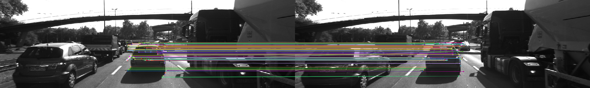
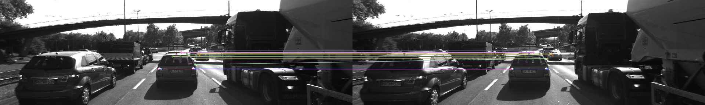
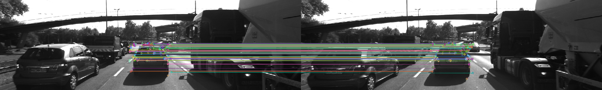
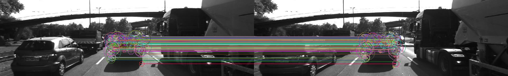
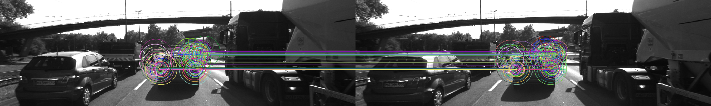
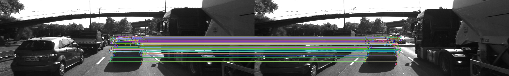
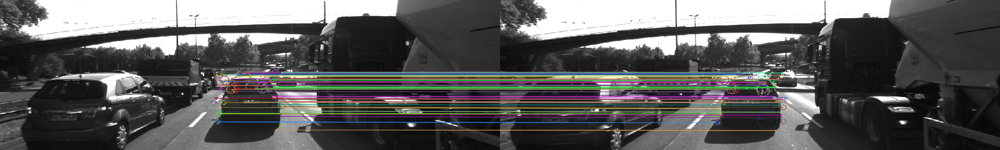

# Report for Project SFND 2D Feature Tracking
[Rubric](https://review.udacity.com/#!/rubrics/2549/view) Points
---
#### 1. MP.1 Data Buffer Optimization
Lines 72-80 in MidTermProject_Camera_Student.cpp
```c++
DataFrame frame;
frame.cameraImg = imgGray;

if(dataBuffer.size() < dataBufferSize)
{
    dataBuffer.push_back(frame);
}
else
{
    dataBuffer.erase(dataBuffer.begin());
    dataBuffer.push_back(frame);
}
```
#### 2. MP.2 Keypoint Detection: Implement detectors HARRIS, FAST, BRISK, ORB, AKAZE, and SIFT and make them selectable by setting a string accordingly.
Lines 101-112 in MidTermProject_Camera_Student.cpp

Lines 156-298 in matching2D_Student.cpp
```c++
//FAST, BRISK, ORB, AKAZE, SIFT
void detKeypointsModern(std::vector<cv::KeyPoint> &keypoints, cv::Mat &img, std::string detectorType, bool bVis, double &detectorTime, int &detectedKpts)
{
    // ...
}

// Detect keypoints in image using the traditional Harris detector
void detKeypointsHarris(vector<cv::KeyPoint> &keypoints, cv::Mat &img, bool bVis, double &detectorTime, int &detectedKpts)
{
   // ...
}
```
#### 3. MP.3 Keypoint Removal
Lines 118-130 in MidTermProject_Camera_Student.cpp
```c++
// only keep keypoints on the preceding vehicle
bool bFocusOnVehicle = true;
cv::Rect vehicleRect(535, 180, 180, 150);
if (bFocusOnVehicle)
{
    vector<cv::KeyPoint> newKpts;
    for (auto kpt : keypoints)
    {
        if(vehicleRect.contains(kpt.pt))
            newKpts.push_back(kpt);
    }
    keypoints = newKpts;
}
```
#### 4. MP.4 Keypoint Descriptors: Implement descriptors BRIEF, ORB, FREAK, AKAZE and SIFT and make them selectable by setting a string accordingly.
Lines 158-161 in MidTermProject_Camera_Student.cpp
```c++
string descriptorType = "BRISK"; // BRISK, BRIEF, ORB, FREAK, AKAZE, SIFT
double descriptorTime;
descKeypoints((dataBuffer.end() - 1)->keypoints, (dataBuffer.end() - 1)->cameraImg, descriptors, descriptorType, descriptorTime);
```
Lines 65-110 in matching2D_Student.cpp
```c++
// Use one of several types of state-of-art descriptors to uniquely identify keypoints
void descKeypoints(vector<cv::KeyPoint> &keypoints, cv::Mat &img, cv::Mat &descriptors, string descriptorType, double &descriptorTime)
{
    // ...
}
```

#### 5. MP.5 Descriptor Matching: Implement FLANN matching as well as k-nearest neighbor selection. Both methods must be selectable using the respective strings in the main function.
Line 7-62 in matching2D_Student.cpp
```c++
    // configure matcher
    bool crossCheck = false;
    cv::Ptr<cv::DescriptorMatcher> matcher;

    if (matcherType.compare("MAT_BF") == 0)
    {
        int normType;
        if(descriptorType.compare("DES_BINARY") == 0)
        {
            normType = cv::NORM_HAMMING;
        }
        else if(descriptorType.compare("DES_HOG") == 0)
        {
            normType = cv::NORM_L2;
        }
        matcher = cv::BFMatcher::create(normType, crossCheck);
    }
    else if (matcherType.compare("MAT_FLANN") == 0)
    {
        if(descSource.type() != CV_32F)
        {
            descSource.convertTo(descSource, CV_32F);
        }
        if(descRef.type() != CV_32F)
        {
            descRef.convertTo(descRef, CV_32F);
        }

        matcher = cv::DescriptorMatcher::create(cv::DescriptorMatcher::FLANNBASED);
    }
```

KNN selection.
```c++
    // perform matching task
    if (selectorType.compare("SEL_NN") == 0)
    { // nearest neighbor (best match)

        matcher->match(descSource, descRef, matches); // Finds the best match for each descriptor in desc1
    }
    else if (selectorType.compare("SEL_KNN") == 0)
    { // k nearest neighbors (k=2)
        vector<vector<cv::DMatch>> knn_matches;
        matcher->knnMatch(descSource, descRef, knn_matches, 2); // k=2

        const float ratio_thresh = 0.8f;
        for (size_t i = 0; i < knn_matches.size(); i++)
        {
            if(knn_matches[i][0].distance < ratio_thresh * knn_matches[i][1].distance)
            {
                matches.push_back(knn_matches[i][0]);
            }
        }
        cout << "# keypoints removed = " << knn_matches.size() - matches.size() << endl;
    }
```

#### 6. MP.6 Descriptor Distance Ratio
Lines 47-61 in matching2D_Student.cpp

Check second code section in MP.5.

#### 7. MP.7: Count the number of keypoints on the preceding vehicle for all 10 images and take note of the distribution of their neighborhood size.

Following this [Q&A](https://knowledge.udacity.com/questions/105491), I saved the number of detected keypoints in the [result_roi.csv](./results/result_roi.csv) file. The results are further summarized in the following table. Note that the distribution of keypoints' neighborhood size can be seen from the images.

DETECTOR  | IMAGE               | Average number of keypoints in ROI
--------  | --------------------| -------------------
SHITOMASI |  | 118
HARRIS    |     | 25
FAST      |       | 149
BRISK     |      | 276
ORB       |        | 116
AKAZE     |      | 167
SIFT      |       | 139

HARRIS detected the least amount of keypoint in the ROI, while BRISK detected the most. Other detecotrs (SHITOMASI, FATS, ORB, SIFT) have a comparable amount of keypoints.

#### 8. MP.8: Count the number of matched keypoints for all 10 images using all possible combinations of detectors and descriptors. In the matching step, the BF approach is used with the descriptor distance ratio set to 0.8.

Following this [Q&A](https://knowledge.udacity.com/questions/105491), I saved the number of matched keypoints in the [result.csv](./results/result.csv) file. The results are further summarized in the following table.
##### MP.8 Results: Average number of matched keypoints for detector-descriptor pairs
| Det\Desc  | BRISK | BRIEF | ORB | FREAK | AKAZE | SIFT | 
|-----------|-------|-------|-----|-------|-------|------|
| SHITOMASI | 85    | 105   | 101 | 85    | N/A   | 103  |
| HARRIS    | 16    | 19    | 18  | 16    | N/A   | 18   |
| FAST      | 100   | 122   | 119 | 98    | N/A   | 116  |
| BRISK     | 174   | 189   | 168 | 169   | N/A   | 183  |
| ORB       | 83    | 61    | 85  | 47    | N/A   | 85   |
| AKAZE     | 135   | 141   | 131 | 132   | 140   | 141  |
| SIFT      | 66    | 78    | N/A | 66    | N/A   | 89   |

#### 9. MP.9: Log the time it takes for keypoint detection and descriptor extraction. The results must be entered into a spreadsheet and based on this data, the TOP3 detector / descriptor combinations must be recommended as the best choice for our purpose of detecting keypoints on vehicles.

I saved the time for keypoint detector and descriptor in the [result.csv](./results/result.csv) file. The results are further summarized in the following table.

#### MP.9 Results : Average time for the detector

| Detector  |  Time (ms) | 
|-----------|:--------------:|
| SHITOMASI |      17        |
| HARRIS    |      21        |
| FAST      |      1         |
| BRISK     |      42        |
| ORB       |      10        |
| AKAZE     |      143       |
| SIFT      |      155       |

#### MP.9 Results : Average time for the descriptor (ms)

| Det\Desc  | BRISK | BRIEF | ORB  | FREAK | AKAZE | SIFT  | 
|-----------|-------|-------|------|-------|-------|-------|
| SHITOMASI | 2.00  | 1.59  | 1.24 | 42.85 | N/A   | 21.91 |
| HARRIS    | 1.32  | 1.01  | 0.95 | 42.56 | N/A   | 23.03 |
| FAST      | 2.15  | 1.31  | 1.14 | 44.61 | N/A   | 38.16 |
| BRISK     | 3.18  | 1.25  | 5.17 | 44.65 | N/A   | 71.48 |
| ORB       | 1.56  | 0.71  | 5.97 | 43.91 | N/A   | 83.64 |
| AKAZE     | 2.68  | 0.99  | 3.63 | 44.21 | 102.57| 36.52 |
| SIFT      | 1.70  | 0.87  | N/A  | 44.67 | N/A   | 109.44|

Based on the above data, the TOP3 detector-descriptor combinations in this task are:

Det/Desc     | Avg. num of matched keypoints | Total time | Kpts/time ratio
------------ | :----------------------------:| :--------: | :-------------:
FAST+ORB     | 119 keypoints                 | 2.2 ms     | **54** best
FAST+BRIEF   | 122 keypoints                 | 2.5 ms     | 49
FAST+BRISK   | 100 keypoints                 | 3.2 ms     | 31

